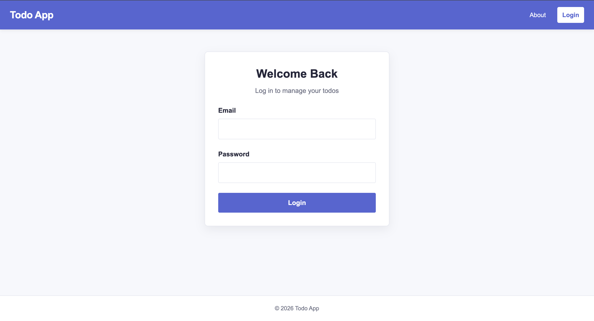
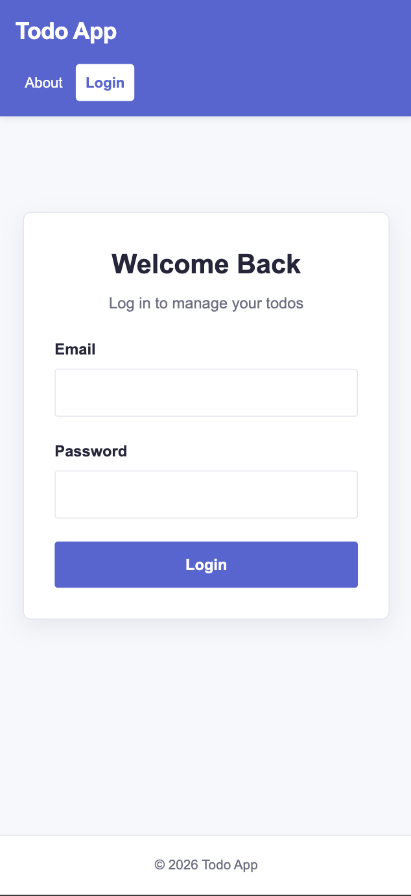

# Todo App

A responsive Todo application built with React and Vite that helps users create, manage, organize, and track their daily tasks.

## Live Demo

[View Live Demo](https://ctd-todo-list-topaz.vercel.app/login)

## Features

- User authentication with login and logout
- Add new todos
- Mark todos as completed
- Edit existing todos
- Cancel todo edits
- Search todos by title
- Filter todos by status:
  - All
  - Active
  - Completed

- Sort todos by:
  - Created date
  - Title

- Sort in ascending or descending order
- URL-based filtering with search parameters
- Protected routes for authenticated users
- User profile page
- Todo statistics:
  - Total todos
  - Completed todos
  - Active todos
  - Completion percentage

- Client-side validation
- Required field validation
- Maximum text length validation
- User-friendly error messages
- Loading and error states
- Responsive design for desktop and mobile devices

## Technologies Used

- React
- Vite
- JavaScript (ES6+)
- React Router
- HTML5
- CSS3
- CSS Modules
- React Context API
- REST API
- Fetch API
- Git
- GitHub
- npm

## Screenshots

### Desktop



### Mobile



## Getting Started

### Prerequisites

Make sure you have the following installed:

- Node.js
- npm
- Git

Check your installed versions:

```bash
node --version
npm --version
git --version
```

### Installation

1. Clone the repository:

```bash
git clone https://github.com/annaliw9/ctd-todoList.git
```

2. Navigate to the project directory:

```bash
cd ctd-todoList
```

3. Install dependencies:

```bash
npm install
```

4. Start the development server:

```bash
npm run dev
```

5. Open the local URL provided by Vite in your browser.

## Available Scripts

### `npm run dev`

Starts the Vite development server for local development.

```bash
npm run dev
```

### `npm run build`

Creates an optimized production build.

```bash
npm run build
```

### `npm run preview`

Previews the production build locally.

```bash
npm run preview
```

### `npm run lint`

Runs ESLint to check the code for potential issues.

```bash
npm run lint
```

## Design Decisions

### CSS Modules

The application uses CSS Modules to keep styles scoped to individual components and pages. This helps prevent class-name conflicts and makes the code easier to maintain.

### Global Design System

Shared colors and typography settings are defined as CSS variables in `index.css`.

The primary application color is:

```css
--color-primary: #5762d5;
```

Using CSS variables keeps the visual design consistent throughout the application.

### Responsive Design

The application uses responsive layouts and CSS media queries to provide a consistent experience across desktop and mobile screen sizes.

On smaller screens, navigation, forms, filters, buttons, and todo items adjust to fit the available space.

### Reusable Components

The application uses reusable components to reduce duplicated code and keep responsibilities separated.

Examples include:

- `TextInputWithLabel`
- `TodoForm`
- `TodoList`
- `TodoListItem`
- `Navigation`
- `Logoff`

Shared form styles are centralized in `FormField.module.css`.

### Client-Side Validation

User input is validated before submitting data.

Todo titles are required and limited to 100 characters. Validation logic is centralized in `todoValidation.js` so the same rules are used when creating and editing todos.

Error messages are written to be clear and user-friendly without exposing technical system details.

## Future Improvements

- Add delete todo function
- Add due dates and reminders
- Add todo categories and tags
- Add priority levels
- Add dark mode
- Add pagination for large todo lists
- Improve search and filtering
- Add charts for todo statistics
- Add automated unit and integration tests
- Add end-to-end testing
- Improve accessibility
- Add offline support
- Improve authentication and session management

## License

This project is licensed under the MIT License.

## Contact

**GitHub:** annaliw9 (https://github.com/annaliw9)

**Portfolio:** Shuna Li (https://shuna-portfolio.vercel.app/)
